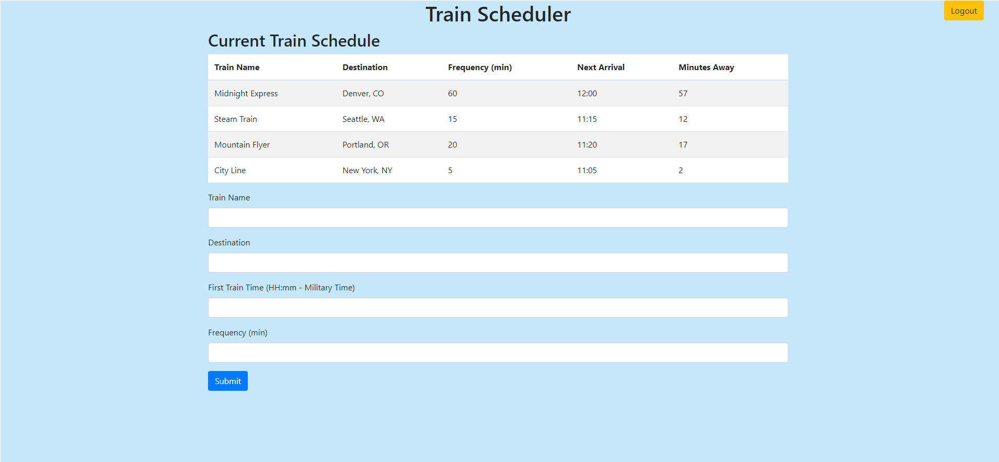

# Train Scheduler

## Train Scheduling App with Firebase

This application allows users to input a train name, destination, departure time, and frequency. This information is pushed to Firebase. Once the data is in Firebase, the app uses Moment.js to manipulate the data and display it to the page by creating a new row in the table. Each trains' next arrival time and minutes away from said arrival time are updated in real-time so the user does not need to refresh the page to see current times. User authentication is required to use this app. A user must sign in with a Google account to be able to see the table and add data to it. A logout function is also provided once a user is logged in.

